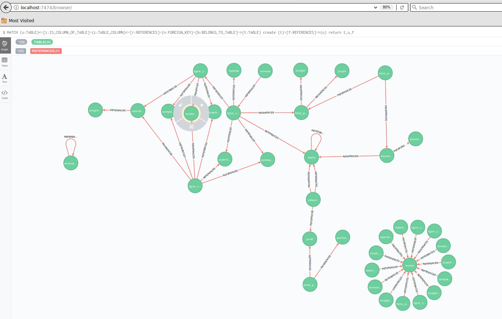
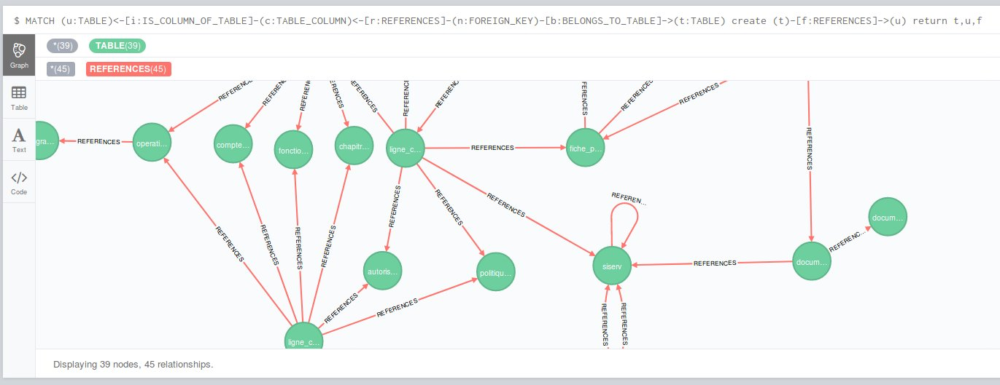

## List all tables

List all tables :

```
match (n:TABLE) return n;
```

Count tables :

```
match (n:TABLE) return count(*);
```

## Lists of paired tables (without columns)

As requested on a schemacrawler ticket (https://github.com/sualeh/SchemaCrawler/issues/141) : 

> create diagram with just tables and relationships, not displaying any columns.

This cyper query returns the table that are linked as well as

```
MATCH (u:TABLE)<-[i:IS_COLUMN_OF_TABLE]-(c:TABLE_COLUMN)<-[r:REFERENCES]-(n:FOREIGN_KEY)-[b:BELONGS_TO_TABLE]->(t:TABLE)
merge (t)-[f:REFERENCES]->(u)
return t,u,f
```

In the neo4j browser you get the following graph :





## Orphan tables

Tables that are not referenced by other tables :

```
MATCH (a:TABLE) where not ((a)-[:REFERENCES]->(:TABLE)) return a;
```


